 

  

---

Self-taught developer from Australia. I run **[ALOS](https://alos.gg)**, a DDoS protection platform, and I build most of the infrastructure it runs on myself, from the web framework up to the kernel.

I like writing things from scratch to find out how fast they can actually go. Most of my work is in Go, and some of it lives inside the Linux kernel.

## ⚡ Stack

## 🛠️ What I'm building

<table>
<tr>
<td width="33%" valign="top">

### 🛡️ [ALOS](https://alos.gg)
A DDoS protection platform. Edge network, mitigation, captcha, the whole stack. This is the main thing I work on every day.

</td>
<td width="33%" valign="top">

### 🧱 ALOSWALL
The in-kernel DDoS firewall behind ALOS. Runs in XDP, the kernel's earliest packet path, and rules on every packet in ~110ns. Fully stateful, SYN cookies in the fast path, live rule changes with zero downtime, and a custom BPF map built to stay fast under attack load.

</td>
<td width="33%" valign="top">

### 🚀 alos-http
A Go web framework written from scratch to be the fastest web framework in the world. Every page ALOS serves goes through it.

</td>
</tr>
</table>

## 🛡️ ALOSWALL in action

  

---

**[alos.gg](https://alos.gg)** · **[xertz@alos.gg](mailto:xertz@alos.gg)**

